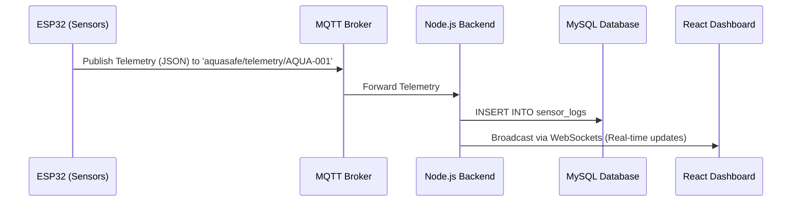
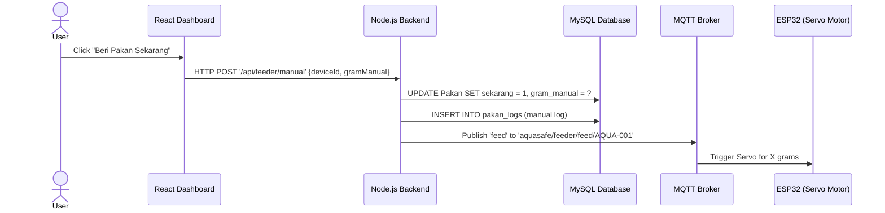
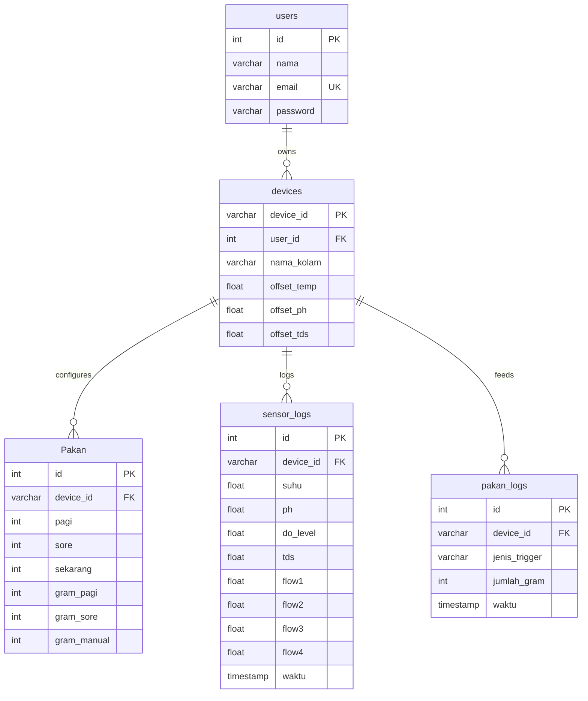

# System Design - AquaSafe

## 1. System Architecture
AquaSafe is an IoT system composed of four main layers: **Hardware (ESP32)**, **Message Broker (MQTT)**, **Backend Service (Node.js/Express/WebSockets)**, and **Frontend Client (React)**.



---

## 2. Deep Dive: Data Flow Pipelines

### 2.1. Telemetry Monitoring Pipeline
This pipeline describes how water parameter measurements travel from the physical pond to the user's screen.

1. **Sensor Reading:** The ESP32 micro-controller reads analog signals from the temperature, pH, DO, and TDS sensors every 5 seconds.
2. **MQTT Publish:** The ESP32 formats these values into a JSON payload and publishes it to the MQTT Broker:
   * **Topic:** `aquasafe/telemetry/AQUA-001` (where `AQUA-001` is the unique Device ID)
   * **Payload:**
     ```json
     {
       "suhu": 29.5,
       "ph": 7.2,
       "do": 6.5,
       "tds": 450,
       "flow1": 10.2,
       "flow2": 8.5
     }
     ```
3. **Backend Processing:** The Node.js server subscribes to `aquasafe/telemetry/+`. When it receives a message:
   * It extracts the `deviceId` from the topic.
   * It applies calibration offsets from the database cache (`offset_temp`, `offset_ph`, etc.).
   * It saves the calibrated records to the MySQL `sensor_logs` table.
4. **WebSocket Broadcast:** The Node.js server immediately broadcasts the updated data payload to all connected Web Browser clients via WebSockets (`ws.send`).
5. **UI Rendering:** The React dashboard receives the WebSocket message and updates the state, causing the gauge charts and historical graphs to re-render in real-time.

---

### 2.2. Feeding Control Pipeline (Manual Override)
This pipeline describes what happens when a user clicks the "Feed Now" button on the dashboard.



1. **User Action:** The user clicks "Beri Pakan Sekarang" on the React Dashboard.
2. **HTTP Request:** The dashboard sends an HTTP POST request to `/api/feeder/manual` containing the `deviceId` and `gramManual` (amount of feed in grams).
3. **Database Write:** The backend updates the `Pakan` table (setting `sekarang = 1`) and writes a record to `pakan_logs` for historical reference.
4. **MQTT Trigger:** The backend publishes a message containing the feeding amount to the MQTT topic:
   * **Topic:** `aquasafe/feeder/feed/AQUA-001`
   * **Payload:** `{"action": "feed", "amount": 50}` (50 grams)
5. **Physical Execution:** The physical ESP32 controller (subscribed to `aquasafe/feeder/feed/+`) receives the message, parses the payload, runs the servo motor to drop the feed, and resets its status.

---

### 2.3. CCTV Video Stream Forwarding Pipeline
Because ESP32-CAM microcontrollers are low-power and cannot handle multiple parallel web connections, the backend acts as a stream repeater.

1. **ESP32-CAM Stream:** The camera board establishes an HTTP POST connection to the Node.js server at `/api/camera/stream/AQUA-001`. It continuously writes raw JPEG frames formatted as an MJPEG multipart stream.
2. **WebSocket Relay:** The Node.js server acts as an MJPEG parser. Every time a new raw JPEG buffer is received from the camera, the server forwards that binary buffer via WebSockets directly to the React dashboard.
3. **React Render:** The React component (`cctvKolam.jsx`) receives the raw binary JPEG array and converts it into a local object URL (`URL.createObjectURL(blob)`), displaying it inside a standard `` tag at 15-30 frames per second.

---

## 3. Database Schema Details
The database structure is designed to persist user details, device metadata, calibration variables, and event logs:


